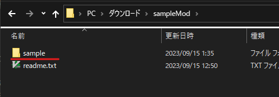

※以下ゲームフォルダ（ゲームのzipを解凍した中の`異世界の創造者1.1.4.0(製品版)`といったフォルダ）は`異世界の創造者`フォルダで表記統一

## Modローダー（maginai）の導入


### 1. 必要なファイルを解凍・ゲーム内に配置

maginaiのリリースzipを解凍すると中に`mod`フォルダがあるのでそれを`異世界の創造者/game/js`フォルダの中にコピーします。  
`異世界の創造者/game/js`に`game`, `jquery`, `libs`, `mod`の4つのフォルダがあれば正しい状態です。  


### 2. index.htmlを編集
`異世界の創造者/game/index.html`をメモ帳等テキストエディタで開き、`./js/game/union.js`の読み込みの後ろに以下の2行を追加します。  

```html
<script src="./js/mod/config.js"></script>
<script src="./js/mod/loader.js"></script>
```

index.htmlが以下のようになっていれば正しい状態です（一部抜粋）  

```html
...
<script src="./js/libs/jspng.worker.js"></script>
<script src="./js/libs/jspng2.worker.js"></script>
<script src="./js/game/union.js"></script>
<script src="./js/mod/config.js"></script>
<script src="./js/mod/loader.js"></script>
<script type="text/javascript">
...
```

### 3. 導入成功確認

ゲームを起動し、タイトルの左下に`Mod loader 'maginai' vX.Y.Z`（X.Y.Z はバージョン）の文字が出ていればModローダー導入成功です。  


文字が赤字だったり表示されていない場合は導入手順に見落としがないか確認してください。  
詳細なエラーメッセージはブラウザの開発者コンソールで確認できます。  
開発者コンソールはGame.exeから起動した場合は見られないので、原因調査はindex.htmlからの起動で行うことをおすすめします。  

※開発者コンソールはChromeの場合メニュー＞その他のツール＞デベロッパーツールで開けます。  
※F12はゲームが開始すると効かなくなります  

### アップデート対応について
ゲームのバージョンアップをした場合やmaginai自体のバージョンアップをする場合は再度この導入作業を行ってください。  
`mods`フォルダ（各種Modと`mods_load.js`が格納されているフォルダ）は特段アナウンスがなければそのまま前のものをコピーできますが  
index.htmlは前使っていたものをコピー上書きするのではなく、再度ロード用タグの書き込みを行うことをおすすめします。

## Modの導入
Modローダーの導入が終わったら

- `init.js`の入っているModフォルダを`mods`フォルダに配置
- `mods_load.js`のリストにMod名を追加

することでModを導入できます。  

### 1. Modの入手・Mod本体フォルダの特定

Discord等で入れたいModを探して入手します。  
※[README](README.md)にもいくつかModを掲載しています  

今回は例としてこちらのsample Modを入れてみます。
zipで配布していますのでダウンロードした後解凍してください。
https://drive.google.com/file/d/1dYoioGayloWRBwKY3CJtLIMJibTxRKb7/view?usp=drive_link

解凍したフォルダの中に`readme.txt`と`sample`フォルダがあります。  
この`sample`フォルダが今回Modとして配置すべきMod本体のフォルダになります。  

  
なお配布物の中でどれがMod本体のフォルダかは、配布者により構成が異なる場合があります。  
readmeの説明や配布者の案内に従ってください。  
また、Mod本体フォルダは必ず直下に`init.js`が格納されていますのでわからなくなった場合は参考にしてください。  

### 2. Modフォルダをmodsに配置

Modローダーを導入済みであれば`異世界の創造者/game/js/mod/mods`フォルダがあるはずですので  
その中にMod本体フォルダ（今回なら`sample`フォルダ）をそのままコピーします。  


### 3. mods_load.jsにロード対象Modとして追加

modsフォルダの中にある`mods_load.js`というファイルをメモ帳等のテキストエディタで開きます。  
`mods`に定義されている配列がロード対象のMod名なので、ここに今配置したModフォルダ名（今回なら`sample`）を追加します。  
※各Mod名は`"`か`'`で囲まれ、間には`,`が必要です。`//`から始まる行はコメントなので削除して問題ありません  

今回の`sample`を追記した後の`mods_load.js`は以下の通りになります（不要なコメントは削除済）。  
```js
LOADDATA = {
  // 読み込むModリスト
  mods: [
    "sample",
  ]
};
```

なお、ここに書かれている順番はModのロード順になります。  
Modによっては正常な利用のために他のModとのロード順の調整が必要になる場合があります。  
（配布者の案内に従ってください）  

### 4. 導入確認
ゲームを起動し、タイトル画面のModローダーの表示部分に赤字がなければ導入成功です。  


ロード中にエラーが発生した場合は`Mod load failed:`というメッセージに続いてエラーになったMod名が赤字で表記されます。  


詳細なエラーメッセージはブラウザの開発者コンソールで確認できます。  
開発者コンソールはGame.exeから起動した場合は見られないので、原因調査はindex.htmlからの起動で行うことをおすすめします。  

また、ここで表示されるのはロード中エラーのみです。  
ゲーム進行中にエラーが発生した場合のエラー確認方法は各Modの案内に従ってください。  
（この場合も開発者コンソールを開いておくとわかる場合が多いかと思います）  

セーブを読み込みゲームを開始すると、sample Modによって追加された「sample modがロードされました」というログが表示されるはずです。  


以上で、Modを導入しゲームの動作を変更することができました。

## Modの削除
`mods_load.js`のリストからMod名を削除すればロードされなくなります。  
また、その状態であればMod本来フォルダを削除しても問題ありません。  
※Modによって追加されたデータがあるセーブをそのModなしで読み込んだときには問題が発生する可能性があります  
　Modを削除した場合の影響についてはMod配布者の案内に従ってください  

## Q&A
### Q. 動作が重い
デフォルトではInfoレベルのログが出るため、Modが出力するログが多すぎて動作が重くなっている場合があります。  
その場合は`mod`フォルダの`config.js`を開き、`logLevel: 'info'`の`info`の部分を`warn`や`error`に変更してください。  
エラー時にしかログ出力されなくなるので、正常動作時の重さが改善する場合があります。  

### Q. zipを入れるだけで導入できないの？/mods_load.jsの編集がめんどくさい
ローカルhtml+javascriptで動く異世界の創造者はCORS制約により特定フォルダ内のすべてのファイルを取るなどの処理が難しくなっています。  
また、導入はzipファイル配置だけでできても、Modのロード順を設定したい場合が少なからずあると思いますので、ロード順の定義でもあるmods_load.jsは必要になります。  
（mods_load.jsを操作しやすくなるGUI等があればもう少し楽かもしれません。コードの貢献はいつでもお待ちしています！）  

