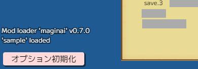
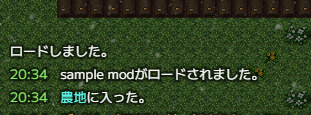
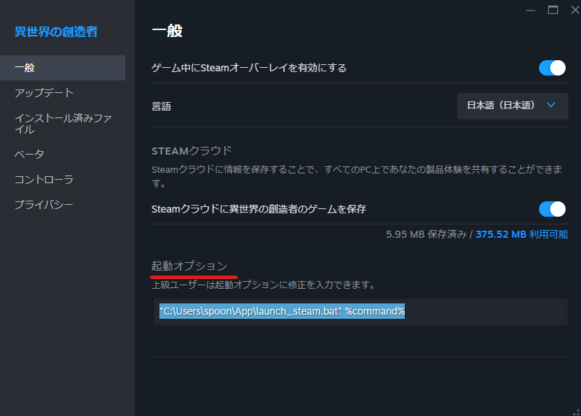

※以下ゲームフォルダ（ゲームのzipを解凍した中の`異世界の創造者1.1.4.0(製品版)`といったフォルダ）は`異世界の創造者`フォルダで表記統一

## Modローダー（maginai）の導入


### 1. 必要なファイルを解凍・ゲーム内に配置
[Release](https://github.com/Spoonail-Iroiro/maginai/releases)ページより最新版の`maginai-X.Y.Z.zip`（X.Y.Zはバージョン）をダウンロードし解凍して下さい。  
解凍した中に`mod`フォルダがあるのでそれを`異世界の創造者/game/js`フォルダの中にコピーします。  
`異世界の創造者/game/js`に`game`, `jquery`, `libs`, `mod`の4つのフォルダがあれば正しい状態です。  


### 2. index.htmlを編集
`異世界の創造者/game/index.html`をメモ帳等テキストエディタで開き、`./js/game/union.js`の読み込みの後ろに以下の2行を追加します。  

```html
<script src="./js/mod/config.js"></script>
<script src="./js/mod/loader.js"></script>
```

index.htmlが以下のようになっていれば正しい状態です（一部抜粋）  

```html
...
<script src="./js/libs/jspng.worker.js"></script>
<script src="./js/libs/jspng2.worker.js"></script>
<script src="./js/game/union.js"></script>
<script src="./js/mod/config.js"></script>
<script src="./js/mod/loader.js"></script>
<script type="text/javascript">
...
```

### 3. 導入成功確認

ゲームを起動し、タイトルの左下に`Mod loader 'maginai' vX.Y.Z`（X.Y.Z はバージョン）の文字が出ていればModローダー導入成功です。  


文字が赤字だったり表示されていない場合は導入手順に見落としがないか確認してください。  
詳細なエラーメッセージは開発者コンソールで確認できます。  
開発者コンソールの開き方は[開発者コンソールの開き方セクション](#開発者コンソールの開き方)を参照してください。

### アップデート対応について
ゲームのバージョンアップをした場合やmaginai自体のバージョンアップをする場合は再度この導入作業を行ってください。  
ただし`mods`フォルダ（各種Modと`mods_load.js`が格納されているフォルダ）は特段アナウンスがなければそのまま前のものをコピーして問題ありません。

ゲームのバージョンアップにおいては、`index.html`は前使っていたものをコピー上書きするのではなく、再度ロード用タグの書き込みを行うことをおすすめします。

## Modの導入
Modローダーの導入が終わったら

- `init.js`の入っているMod本体フォルダを`mods`フォルダに配置
- `mods_load.js`のリストにMod名を追加

することでModを導入できます。  

### 1. Modの入手・Mod本体フォルダの特定

Discord等で入れたいModを探して入手します。  
※[README](README.md)にもいくつかModを掲載しています  

今回は例としてこちらのsample Modを入れてみます。  
zipで配布していますのでダウンロードした後解凍してください。  
https://drive.google.com/file/d/1dYoioGayloWRBwKY3CJtLIMJibTxRKb7/view?usp=drive_link

解凍したフォルダの中に`readme.txt`と`sample`フォルダがあります。  
この`sample`フォルダが今回Modとして配置すべきMod本体のフォルダになります。  


  
なお配布物の中でどれがMod本体のフォルダかは、配布者により構成が異なる場合があります。  
readmeの説明や配布者の案内に従ってください。  
また、Mod本体フォルダは必ず直下に`init.js`が格納されていますのでわからなくなった場合は参考にしてください。  

### 2. Mod本体フォルダをmodsに配置

Modローダーを導入済みであれば`異世界の創造者/game/js/mod/mods`フォルダがあるはずですので  
その中にMod本体フォルダ（今回なら`sample`フォルダ）をそのままコピーします。  


### 3. mods_load.jsにロード対象Modとして追加

modsフォルダの中にある`mods_load.js`というファイルをメモ帳等のテキストエディタで開きます。  
`mods`に定義されている配列がロード対象のMod名なので、ここに今配置したModフォルダ名（今回なら`sample`）を追加します。  
※各Mod名は`"`か`'`で囲まれ、間には`,`が必要です。`//`から始まる行はコメントなので削除して問題ありません  

今回の`sample`を追記した後の`mods_load.js`は以下の通りになります（不要なコメントは削除済）。  
```js
LOADDATA = {
  // 読み込むModリスト
  mods: [
    "sample",
  ]
};
```

なお、ここに書かれている順番はModのロード順になります。  
Modによっては正常な利用のために他のModとのロード順の調整が必要になる場合があります。  
（配布者の案内に従ってください）  

### 4. 導入確認
ゲームを起動し、タイトル画面左下のModローダーの表示部分に赤字がなければ導入成功です。  
Modローダーのバージョン表記の下にはロードに成功したMod名が表示されます。  


ロード中にエラーが発生した場合は`Mod load failed:`というメッセージに続いてエラーになったMod名が赤字で表記されます。  


詳細なエラーメッセージは開発者コンソールで確認できます。  
開発者コンソールの開き方は[開発者コンソールの開き方セクション](#開発者コンソールの開き方)を参照してください。

また、この時点で表示されるのはロード中エラーのみです。  
ゲーム進行中にエラーが発生した場合のエラー確認方法は各Modの案内に従ってください。  
（この場合も開発者コンソールを開いておくとわかる場合が多いかと思います）  

セーブを読み込みゲームを開始すると、sample Modによって追加された「sample modがロードされました」というログが表示されるはずです。  



以上で、Modを導入しゲームの動作を変更することができました。

## Modの削除
`mods_load.js`のリストからMod名を削除すればロードされなくなります。  
また、その状態であればMod本体フォルダを削除しても問題ありません。  

※  
Modによって追加されたデータがあるセーブをそのModなしで読み込んだときには問題が発生する可能性があります。  
Modを削除した場合の影響についてはMod配布者の案内に従ってください。  

## 開発者コンソールの開き方
開発者コンソールにはmaginaiやModのシステムメッセージやエラーメッセージが表示され、トラブルシューティングに役立ちます。  
異世界の創造者のどのプラットフォーム版を使っているかで利用可能な方法が異なります。  

### (DLSite版のみ)異世界の創造者をブラウザから起動し、ブラウザの開発者コンソールを開く
`異世界の創造者/game/index.html`をブラウザで開くことで異世界の創造者をブラウザで起動することができます。  
（この起動方法は★はじめにお読みください.txtで説明されているMac/Linuxでの起動方法と同じです。Windowsでも利用可能です）  
この方法で起動した上で開発者コンソールを開きます。  

使用ブラウザはGoogle Chrome or Edge推奨です。  

開発者コンソールはGoogle Chromeの場合メニュー＞その他のツール＞デベロッパーツールで開けます。  
他のブラウザの場合はそれぞれのブラウザの開発者コンソールの開き方の案内に従ってください。


### (DLSite版・Steam版両対応)異世界の創造者をGame.exeから起動する際に開発者コンソールを開くよう設定
Steam版ではブラウザから起動ができないので、こちらの方法でGame.exeから起動した際に開発者コンソールも開くようにします。  
DLSite版でも使用可能です。

開発者コンソールを開くには、環境変数`WEBVIEW2_ADDITIONAL_BROWSER_ARGUMENTS`を`--auto-open-devtools-for-tabs`に設定してGame.exeを起動します。  

以下では不慣れな人向けに、batファイルでこれを行うやり方を説明します。  
（システムへの影響を避けるためにも一時的に環境変数を設定するこのやり方がおすすめです）

#### batファイルから起動する方法

まず以下の内容でテキストファイルを作り`launch.bat`という名前で保存します。

```bat
@echo off
chcp 65001
cd "C:\Program Files (x86)\Steam\steamapps\common\isekainosouzousha"
set WEBVIEW2_ADDITIONAL_BROWSER_ARGUMENTS=--auto-open-devtools-for-tabs
start "" Game.exe
```

ただしDLSite版や、Steam版でSteamのインストールパスを変えている方は`C:\Program Files (x86)\Steam\steamapps\common\isekainosouzousha`の部分を、インストール先のフォルダパス（Game.exeがあるフォルダパス）に書き換えてください。  
Steam版で、Steamのインストール場所がデフォルトのままの場合は上記の内容がそのまま使えると思います。  

`launch.bat`ファイルができたらこれをダブルクリックすれば異世界の創造者を開発者コンソールを開いた状態で起動できます。  
※画像ではmydataの読み込みエラーが出ていますが正常です


※Steamが起動していないとbatをダブルクリックしても以下のエラーが表示され起動できません。起動前にSteamが起動しているか確認してください。うまくいかない場合は次の「Steamライブラリから起動する方法」を試してください。


#### Steamライブラリから起動する方法
Steam版の場合、起動用batスクリプトを作り起動時オプションで呼び出すことでSteamのライブラリから起動する場合でも開発者コンソールを開けます。

まず以下の内容でテキストファイルを作り`launch_steam.bat`という名前で保存します。  

```bat
@echo off
set WEBVIEW2_ADDITIONAL_BROWSER_ARGUMENTS=--auto-open-devtools-for-tabs
start "" %1
```

次にSteamのライブラリで異世界の創造者を右クリック、プロパティを開いて起動オプションの欄に以下を入力します。

```
"C:\path\to\launch_steam.bat" %command%
```

ただし`"C:\path\to\launch_steam.bat"`の部分は保存した`launch_steam.bat`のパスに置き換えてください。  
起動オプションが正しく設定できていると以下のようになります。



これらの設定が完了すると、ライブラリから異世界の創造者を起動した場合に一緒に開発コンソールも開くようになります。

#### 一時的に開発者コンソールをオフにする
bat起動でもSteamライブラリ起動でも、batファイルの`set WEBVIEW2_...`の行の頭に`rem `をつけると、通常通り開発者コンソールを開かず起動するようになります。

```
rem set WEBVIEW2_ADDITIONAL_BROWSER_ARGUMENTS=--auto-open-devtools-for-tabs
```

## Q&A

### Q. 動作が重い
デフォルトではInfoレベルのログが出るため、Modが出力するログが多すぎて動作が重くなっている場合があります。  
その場合は`mod`フォルダの`config.js`を開き、`logLevel: 'info'`の`info`の部分を`warn`や`error`に変更してください。  
エラー時にしかログ出力されなくなるので、正常動作時の重さが改善する場合があります。  

### Q. zipを入れるだけで導入できないの？/mods_load.jsの編集がめんどくさい
ローカルhtml+javascriptで動く異世界の創造者はCORS制約により特定フォルダ内のすべてのファイルを取るなどの処理が難しくなっています。  
また、導入はzipファイル配置だけでできても、Modのロード順を設定したい場合が少なからずあると思いますので、ロード順の定義でもあるmods_load.jsは必要になります。  
（mods_load.jsを操作しやすくなるGUI等があればもう少し楽かもしれません。コードの貢献はいつでもお待ちしています！）  

