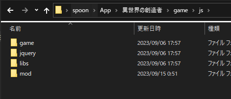
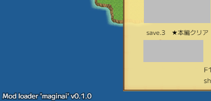
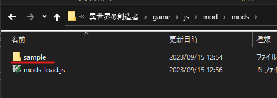
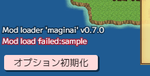
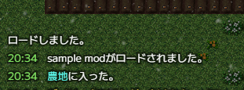
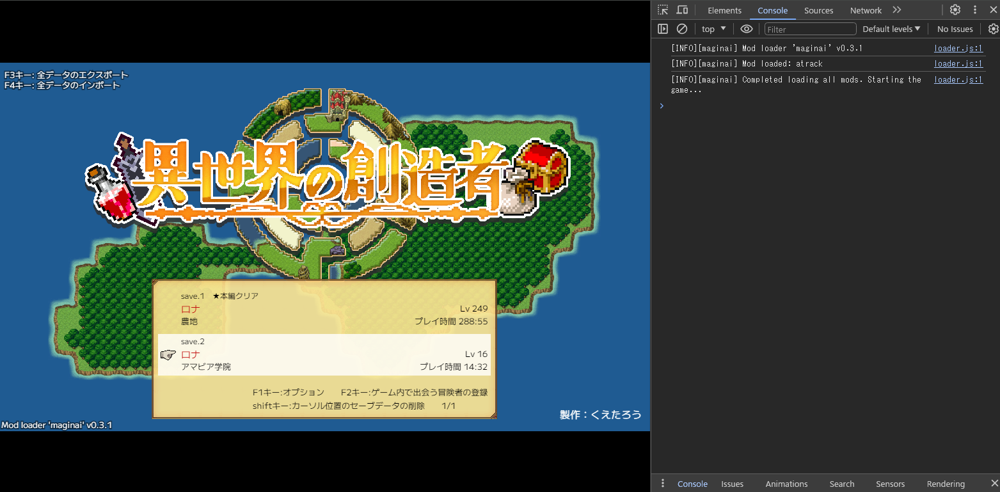
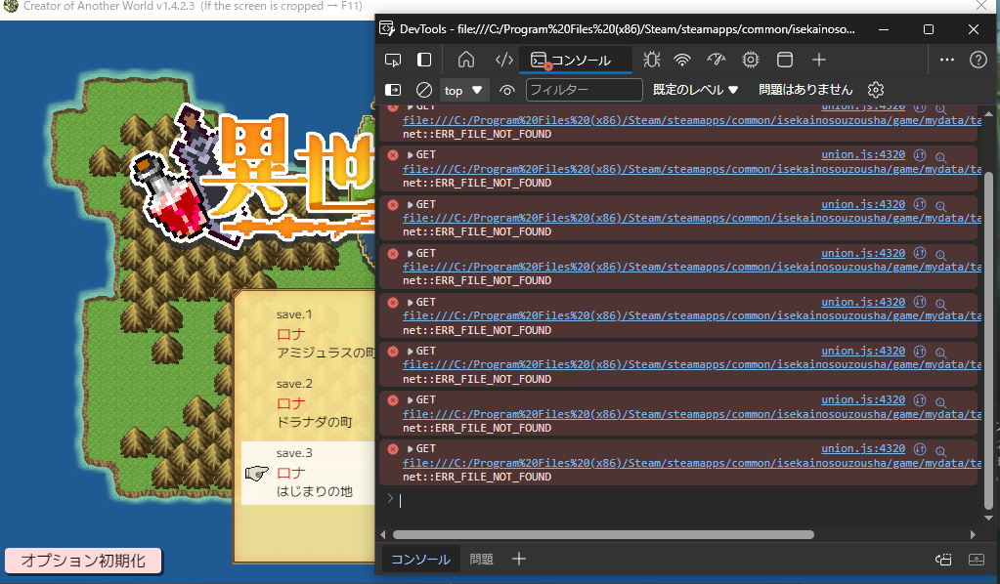
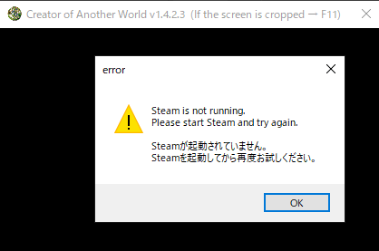
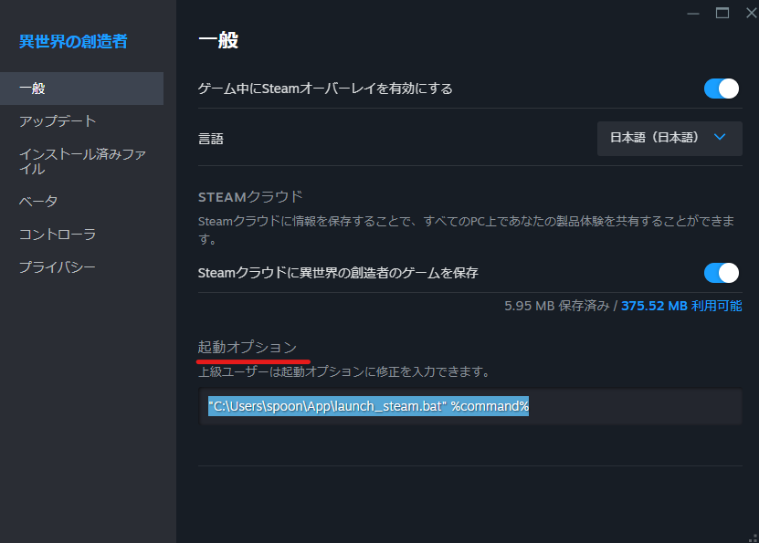

\* In this document, `CoAW/` path means the game directory, which contains `Game.exe`

## How to Install Mod Loader 'maginai'
\* It's highly recommended to use the mod manager `gmaginai-l` to install the mod loader.  
[**gmaginai-l**](https://github.com/Spoonail-Iroiro/gmaginai-l/blob/master/README.md)  

The steps below describe how to install the mod loader manually.

### 1. Place Mod Loader Files in the Game Directory
Download and unzip latest `maginai-X.Y.Z.zip` (X.Y.Z is the version number) from [Release](https://github.com/Spoonail-Iroiro/maginai/releases).  
Copy `mod` folder inside it to `CoAW/game/js`.  
If you have the following four folders in `CoAW/game/js`: `game`, `jquery`, `libs`, and `mod`, then everything is in the correct state.



### 2. Edit `index.html`
Open `CoAW/game/index.html` with a text editor (Notepad works fine) and add these two lines after the line of `./js/game/union.js`:

```html
<script src="./js/mod/config.js"></script>
<script src="./js/mod/loader.js"></script>
```

If your `index.html` looks like the following, then everything is in the correct state:

```html
...
<script src="./js/libs/jspng.worker.js"></script>
<script src="./js/libs/jspng2.worker.js"></script>
<script src="./js/game/union.js"></script>
<script src="./js/mod/config.js"></script>
<script src="./js/mod/loader.js"></script>
<script type="text/javascript">
...
```

### 3. Test Installation
If, upon launching the game, you see the text `Mod loader 'maginai' vX.Y.Z` (where X.Y.Z is the version number) at the bottom left of the title, then the mod loader has been successfully installed. 



If the text appears in red or is not displayed at all, please check the installation steps again.   

You can find detailed error messages in the developer console.  
(For how to, see [How to Open the Developer Console Section](#how-to-open-the-developer-console).)

### How to Update
If you updated CoAW or want to update maginai, follow this installation steps again.  
However, unless specifically announced, you can simply copy the existing `mods` folder, which contains mods and `mods_load.js`, without any issues.

## Install a Mod
\* It's highly recommended to use the mod manager `gmaginai-l` to install mods.  
[**gmaginai-l**](https://github.com/Spoonail-Iroiro/gmaginai-l/blob/master/README.md)  

The steps below describe how to install mods manually.

### Manual Install

If you completed installing maginai, you can now install a mod by:

1. Copy a mod folder, which contains `init.js`, to `mods` directory
2. Add the name of the mod folder to the list in `mods_load.js`

### 1. Get a Mod
Get the desired mod from [Discord (CoAW modding)](https://discord.gg/RgYrD3uPZM) or somewhere.  
[README](README.md) also has a mods list.

Now, as an example, let's try installing a sample mod, which just logs a message "sample modがロードされました" when the game starts.  
Download and unzip the distribution file from the following link:

https://drive.google.com/file/d/1dYoioGayloWRBwKY3CJtLIMJibTxRKb7/view?usp=drive_link

Inside the extracted folder, you'll find `readme.txt` and `sample` folder.   
The `sample` folder is the mod's main folder that should be placed in `mods` directory.

Please note that the structure of distribution materials may vary depending on the mod author.  
Follow the instructions in the readme or the author's guidance.   
If you're still unsure where mod's main folder is, the mod's main folder always contains an `init.js` file directly inside it, so find it. 

### 2. Copy Mod's Main Folder to `mods`

You've completed installing maginai, so you have `CoAW/game/js/mod/mods` directory.  
Copy mod's main folder (it's `sample` now) there.



### 3. Add Mod's Name to the List in `mods_load.js`

Open the file named `mods_load.js` inside the `mods` directory with a text editor.  
The list defined in `mods` should contain the names of the mods to be loaded.  
Add the name of the mod folder you just placed (it's `sample` now) to the list.  
* Each mod name should be enclosed in either double quotes (`"`) or single quotes (`'`), and a comma `,` is required between each name.
* Lines starting with `//` are comments, so they can be deleted without any issues.

After adding `sample`, the `mods_load.js` will look like this (comments removed):

```js
LOADDATA = {
  // 読み込むModリスト
  mods: [
    "sample",
  ]
};
```
Additionally, the order defined here determines the order in which mods are loaded.   
Some mods may require adjustments to the loading order to function properly alongside others. (Please follow the mod author's guidance).

### 4. Test Installation
If you launch the game and there are no red text in the `Mod Loader 'maginai'...` section of the title screen, the installation is successful.  
It also shows the names of the mods loaded successfully.


If an error occured during loading, a message starting with `Mod load failed:` followed by the name of the mod that caused the error will be displayed in red.



You can find detailed error messages in the browser's developer console.  
(For how to, see [How to Open the Developer Console Section](#how-to-open-the-developer-console).)

Additionally, only loading errors are displayed on the title screen.   
Follow the instructions provided by each mod for checking errors that occur during gameplay.   
(In many cases, the developer console will provide useful information here again)

Now, if you select a save slot and the game starts, you should see a log message saying 'sample modがロードされました' (means "sample mod has been loaded"), which was added by the `sample` mod.



With this, you've successfully installed a mod and the mod altered the game's behavior.

## How to Remove a Mod
Remove the mod name from the list in `mods_load.js`.  
maginai ignores mods not listed in `mods_load.js`, so you can remove mod's main folder after that.  

## How to Open the Developer Console

The developer console shows logs and error messages from maginai and mods, which are useful for troubleshooting.

The available methods vary depending on which platform version of CoAW you are using.

### (DLSite Version Only) Open the Developer Console from the Browser

Open `CoAW/game/index.html` with your browser and open the developer console.  
(It's the same as the starting steps described in '★Please read this first.txt' for Mac/Linux. It's also available for Windows.)  

For the browser, Google Chrome or Edge is recommended.

In Google Chrome, you can open the developer console by navigating to Menu > More Tools > Developer Tools.  
For other browsers, refer to the respective browser's instructions on how to open the developer console.  



### (Both DLSite Version and Steam Version) Set Envvar to Open Developer Console When Game.exe is Launched

As running CoAW on a browser is not supported in the Steam version, you should open the developer console with Game.exe.  
This method is also available for the DLSite version

To open the developer console, set the environment variable `WEBVIEW2_ADDITIONAL_BROWSER_ARGUMENTS` to `--auto-open-devtools-for-tabs` and launch Game.exe.

Below, we explain how to do this with a bat file for those who are unfamiliar with things like this.  
(The is also a good method in term of avoiding effect on the system-wide environment)

#### Launch from a bat File

First, create a text file with the following content and save it as `launch.bat`:

```bat
@echo off
chcp 65001
cd "C:\Program Files (x86)\Steam\steamapps\common\isekainosouzousha"
set WEBVIEW2_ADDITIONAL_BROWSER_ARGUMENTS=--auto-open-devtools-for-tabs
start "" Game.exe
```

For the DLSite version or if you have changed the installation path for Steam version, replace `"C:\Program Files (x86)\Steam\steamapps\common\isekainosouzousha"` with the folder path where Game.exe is located.
If Steam's installation location is the default one, the content above should work as it is.

Now, double-clicking `launch.bat` will launch CoAW with the developer console window open.  
\* In the image, `mydata` loading error is shown but it's working properly.



\* If Steam is not running, an error message window like the following will be displayed, and the game will not start. Please make sure Steam is running. If it still doesn't work, try "Launch from Steam Library" steps described in the next section.



#### Launch from Steam Library

With a bat file and launch options, you can also open the developer console when you launch CoAW from Steam Library.

First, create a text file with the following content and save it as "launch_steam.bat":

```bat
@echo off
set WEBVIEW2_ADDITIONAL_BROWSER_ARGUMENTS=--auto-open-devtools-for-tabs
start "" %1
```

Next, right-click CoAW in your Steam library, open Properties, and enter the following in the Launch Options field:

```
"C:\path\to\launch_steam.bat" %command%
```

Replace `"C:\path\to\launch_steam.bat"` with the path where you saved `launch_steam.bat`.
If you set it correctly, it will look like this:



After these settings have completed, launching CoAW from the Steam Library will also open the developer console.

#### Disable the Developer Console

Whether launching from a bat file or from the Steam Library, you can make the game launches normally without the developer console by adding `rem ` at the beginning of the line containing `set WEBVIEW2_...` in the bat file.

```
rem set WEBVIEW2_ADDITIONAL_BROWSER_ARGUMENTS=--auto-open-devtools-for-tabs
```

## Q&A
### Q. The Game is Laggy!
By default, mods' log level is set to `Info` and too many logs can affect performance.  
Open the `config.js` in `mods` directory and replace `info` in `logLevel: 'info'` with `warn` or `error`.  
It supresses non-important logs, so performance might be improved.

### Q. I want to install a mod by just placing the mod's folder in `mods`. Editing `mods_load.js` is tedious.
CoAW is running on local HTML+JavaScript, so due to CORS restrictions, it's difficult to access all files within a specific directory.  
Additionally, while installation may be possible with just placing the mod folder, there are often scenarios where one wants to configure the loading order of mods, hence the necessity of `mods_load.js,` which serves as a definition for loading order.  
(Having a GUI application or something for editing `mods_load.js` might make it easier. Contributions are always welcome!)"
