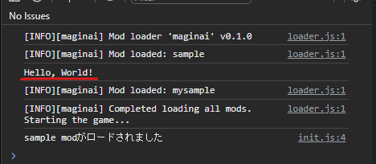
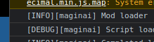

\* You can access the table of contents from the hamburger button in the top right corner. If the button is not visible, reloading this page may make it appear correctly.

# The Simplest Mod
Name your mod and create a folder with that name, then create an `init.js` file inside it.  
For example, let's create a mod named `mysample`.

```text
mysample/
┗━━init.js
```

```js
//init.js
console.log("Hello, world!");
```

Place this `mysample` folder into the `mods` directory and add the mod name to the list in `load_mods.js`, as described in mod installation steps. Then, the mod will be loaded.

Since the mod code uses console.log to output a message to the developer console, let's open it.   
(For how to, see [How to Open the Developer Console Section](INSTALL_en.md#how-to-open-the-developer-console).)



You should see that the code inside `init.js` is executed and the message is displayed.  
Additionally, you'll notice that the code written in `init.js` is executed during mod loading, before the game loads.

Congratulations! You've created your mod.

# Modifying the Game
However, despite being a mod, it doesn't affect anything in the game yet.  
You could write all the code to modify the game yourself, but maginai provides some utilities.  
Methods and modules provided by maginai can be accessed through the `maginai` global variable anywhere in your mod code.  

[For Beginners](#for-beginners)  
[For Experts](#for-experts)  

## For Experts
This explanation is for those who are already writing codes to modify the game.

The execution order of the game's main script `union.js`, maginai's entry point `loader.js`, mod's `init.js`, and events provided by maginai is as follows:  
1. Execution of `union.js` (the game's main script)
2. Execution of `loader.js` (maginai's main script)
3. `init.js` of a mod
4. [Postprocess](#postprocess) of a mod 
5. (Repeat steps 3 and 4 until all mods defined in `mods_load.js` are loaded)
6. `tWgm = new tGameMain({});`
7. `tWgmLoaded` event
8. `gameLoadFinished` event (just before displaying the title screen)
9. Display the title screen
10. (User selects a save)
11. `saveLoaded` event

The main places where code to modify the game are as follows:  
- Modify methods: Directly in `init.js`
    - At the time of loading the mod's `init.js`, `union.js` has already been executed and classes, etc. are defined, so they can be modified
    - You can use `maginai.patcher.patchMethod` to patch method in class
- Async functions such as loading external data: Register them as [Postprocess](#postprocess)
    - Use `maginai.setModPostprocess` to set a `Promise` as Postprocess
- Modifying data: `gameLoadFinished` [event](#events) 
    - The event fires just before displaying the title screen, the initialization of instances of each game class such as `tGameTalkResource` or `tGameCharactor`, which are members of `tWgm`, is completed. So you can modify tone data, etc. there.
- Access data in the save: `saveLoaded` [event](#events)
    - The event fires after selecting save data and just before the character becomes controllable by player, so you can make modifications that need to access the loaded save data there.

### Postprocess
Since only synchronous code can be written in `init.js`, to complete asynchronous processing before loading the next mod (and before loading the game), use the Postprocess feature provided by maginai.  
By calling `maginai.setModPostprocess` with a `Promise` object as an argument, the next mod will not be loaded until that `Promise` is completed.  

```js
// init.js
// ...
// Variable to store the loaded message
let message;

// Load the message from an external js file
const postprocess = maginai
  .loadJsData("./js/mod/mods/buildsample/message.js") 
  .then((loaded) => {
    // Set the loaded message to the variable
    message = loaded["message"];
  });
// Set the Promise using setModPostprocess so that the message loading is guaranteed to finish before the next mod starts loading (and before the game starts loading)
maginai.setModPostprocess(postprocess);
// * If you want to set multiple Promises as Postprocess, you need to use `Promise.all` or chain them with `then` to make them into a single Promise before setting
// ...
```

### Events
Under `maginai.events`, events that fire at specific timings during the game are defined.  
You can register your event handler with calling event's `addHandler` method.

```js
// init.js
// ...
const logger = maginai.logging.getLogger('sample')
// Register an event handler to display a message on the dev console when the game complete loading
maginai.events.gameLoadFinished.addHandler(() => {
    logger.info("Hello, World")
});
// ...
```

All events and args type of the handlers are listed here:  
https://spoonail-iroiro.github.io/maginai/classes/MaginaiEvents.html

## For Beginners
This explanation is for those who haven't wrote codes for CoAW yet.  
(Though eventually you need to understand the game's internals...)

### Modifying Loaded Data
By replacing character tone data, item master data, etc., you can change the behavior in the game.  

Note that `init.js` is loaded during mod loading, before the game data is loaded.  
If you write data replacement processing in `init.js`, an error will occur because the data to be replaced has not been loaded yet.  

In such cases, use the `gameLoadFinished` event defined under `maginai.events`.  
Under `maginai.events`, there are various events to which handlers can be registered using the `addHandler` method, and `gameLoadFinished` is an event that occurs **when the game complete loading various data**.  

The following is an example of an `init.js` that replaces the "Loaded." message, which is shown when starting the game after selecting a save, with "Hello, World!".
```js
// init.js
(function () {
  // Assign to a variable for name shortening
  const ev = maginai.events;

  // When the game complete loading and the title screen is displayed...
  ev.gameLoadFinished.addHandler(() => {
    // This ...load_ok is "Loaded." text, which is shown in in-game log when complete loading a save, so replace it
    tWgm.tGameTalkResource.talkData.system.load_ok = "Hello, World!";
  });
})();
```

#### \* What is `(function(){`〜`})();`?
It's IIFE, a way to prevent variables from interfering with ones in other scripts.  
Even if you don't understand it well, it's good to write it first and place your mod codes in it.

### Modifying Method Behavior
By replacing (monkey patching) various methods, you can change their behavior.  

maginai provides a convenient method for this purpose, the `patchMethod` method of `maginai.patcher`.
For example, the script below replace `tGameLog.addLog` with new method, which replace "Loaded." in the first arg with "Hello, World" and then call the original.

```js
// init.js
(function () {
  // Assign to a variable for name shortening
  const pt = maginai.patcher;

  // Patch addLog method of tGameLog class
  // The third argument newMethodFactory receives origMethod, which is the original addLog method
  pt.patchMethod(tGameLog, "addLog", (origMethod) => {
    // New addLog method...
    const rtnFn = function (message, ...args) {
      // If the message passed as the first arg is "Loaded.", replace it with "Hello, World"
      const newMessage = message.replace("Loaded.", "Hello, World!");
      // Call the original addLog with the replaced message
      origMethod.call(this, newMessage, ...args);
    };
    return rtnFn;
  });
})();
```

It's a bit complicated, but `patchMethod` takes:  

- The first argument is the target class
- The second argument is the method name
- The third argument is a function that returns a new method (in this case, new `addLog` method)

The function as the third argument receives the original method `origMethod` as the first argument, so by calling `origMethod.call(this, ...args)` inside, you can call the original method.  

### Loading External Data
If you want mod users configure your mod, it's better to provide external files instead of having them directly edit `init.js`.  
[This](#postprocess) is an example of loading a external file.

Note that file paths must be relative to `index.html`.  
For example, a file placed directly under the mod's own folder will have a path like `./js/mod/mods/<mod name>/<file name>`.

## If It's Difficult to Implement the Desired Behavior
Please feel free to contact with the author (Spoonail).  
I tried to cover various cases, but there may be some oversights.  
(See [README](README_en.md) for the contact information)  

## Example Mods
You can use mod codes in the repository below as reference:  
https://github.com/Spoonail-Iroiro/maginai-buildsample  
It is also an example of project that has ESModule codes and build them into a mod script (`init.js`).  
You can start with copying it and add anything you like (typesctipt, tests, etc.)  

Additionally, you can use the codes of the mods listed in [README.md](README_en.md#mods-list).  
Not only they contain various codes modifying the game, but also contain full dev environments, such as typescript, linter, formatter, tests, build tools, etc.  
You can start with copying one of them and replace mod name with yours.  
(For example, the repository below is for mod `atrack`. You will need to replace `atrack` in `package.json`, `tools/release.ts`, etc. with your mod's name)  
https://github.com/Spoonail-Iroiro/maginai-atrack


# `maginai` API
Documents for all features which `maginai` exposes is available here:  
[maginai API Documentation](https://spoonail-iroiro.github.io/maginai/classes/Maginai.html)  
\* Items marked with `Internal` are for internal use and are not intended to be used from mod codes  

The global variable `maginai` is actually an instance of the `Maginai` class, so you can use what is exposed under the `Maginai` class.  

The features that are likely to be used frequently are as follows.  
(Basic features introduced so far are omitted)  
- `loadJsData` - Load data from a js file in the format `var LOADDATA = ...`
- `logToInGameLogDebug` - Output log to in-game log (for debugging and error display)
- `VERSION`, `VERSION_INFO` - Version information of `maginai`
  - \* Note that these properties do not exist in v0.2.0, so be careful when comparing
- `modSave` - Submodule for reading/writing save data for each mod
  - Use in conjunction with `saveLoaded` event and `saveObjectRequired` event to read/write each mod's data from/to the save data

For more details, please refer to the documentation.  

# Precautions for Implementation
The explanations so far is sufficient to implement a working mod, but there are some precautions to make a user-friendly mod or due to maginai's constraints.  

## Use logger instead of console.log for logging
In some examples, `console.log` is used for log output for clarity, but it is not recommended in actual mod code.  
Instead, obtain a `Logger` object and perform log output as shown in the example below.  

[https://spoonail-iroiro.github.io/maginai/classes/Maginai.html#logging](https://spoonail-iroiro.github.io/maginai/classes/Maginai.html#logging)

Using a logger makes it clear which mod the log is from, and users can control the display level, etc.  



## Use IIFE in `init.js` 
As mentioned in the 'For Beginners' section, make sure to wrap your codes with IIFE in `init.js`.  
If codes written globally, for example, if two mods declaring the same `const hoge` variable are loaded, the mod loaded later will fail.  

\* `const` and `let` create block scopes, but since there is no guarantee that `var` will not slip in and module scope cannot be used because of CORS, IIFE is recommended.  

## The `tGameMain` class cannot be used directly
The `tGameMain` class is replaced with a dummy class by maginai to delay game initialization.  
If you want to access it, use `maginai.origtGameMain`   
https://spoonail-iroiro.github.io/maginai/classes/Maginai.html#origtGameMain

## Give your mod a distinctive name that is unlikely to be the same with others
Since a mod is actually a folder, you cannot load different mods with the same mod name.  
Also, maginai currntly doesn't have no feature to abstract the path to mod's folder, so changing the mod's folder name by user will cause an error in most case.  
(This may be improved in future updates)  
Give a distinctive name to your mod.  

# Q&A

## Q. Can't I implement a mod with ESModule?
Yes, you can do, but you need to build ESModule(s) into a script (`iife` library) with bundler, such as Rollup (vite internally use it).  
Please read [Example Mods](#example-mods) section to find a project example with bundler.  

\* Creator of Another World, which runs on local html+javascript, cannot load ESModules directly due to CORS restrictions. In other words, loading a script with `<script type="module">` or dynamic `import` causes an error.  

## Q. Aren't there type definitions for `maginai`?
We have!

```sh
npm install maginai
```

### When referencing as a global variable
In a TypeScript project with `moduleResolution` set to `Node16` or `Bundler`, you can define the type of the global variable `maginai` like this:
```ts
declare var maginai: import('maginai/maginai.js').Maginai;
```

In projects with `moduleResolution` other than the above, you can also define types in a similar way as follows, but it is not recommended as the internal module structure may change in the future.

```ts
declare var maginai: import('maginai/lib/modules/maginai.js').Maginai;
```

### When referencing with import
In a project with build/bundle, you can reference `maginai` module with import in the source as follows. 
```js
import maginai from 'maginai';

maginai.events.tWgmLoaded.addHandler(...
```
Make sure to configure the bundler to reference `maginai` as a global variable instead of including it in the bundle.  
Please read [Example Mods](#example-mods) section to find a project example with bundler.  
`vite.config.js` or `vite.config.ts` in the project is already configured like that.  

### Handler types for `maginai.events` are not displayed
Currently in preparation.  
The types of arguments to handlers are described in JSDoc, so please refer to them.  

### Types for `maginai.logging` are not displayed
Currently in preparation.  
See [API Docs](https://spoonail-iroiro.github.io/maginai/classes/Maginai.html#logging) for usage.

## Q. Aren't there type definitions for `union.js`?
It can be installed as package `maginai-game-types`.  
For details, please read the repository readme below:  
https://github.com/Spoonail-Iroiro/maginai-game-types

## Q. Can't I use async functions?
You can use them.  
Since async functions return a `Promise`, register it as a Postprocess.   
(See [Postprocess](#postprocess)).  

\* Since `init.js` is not a module, top-level await will result in an error.  
